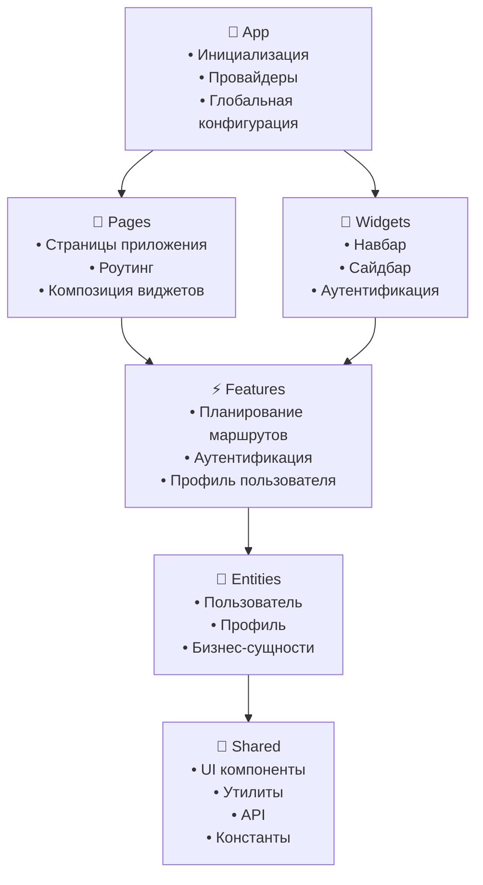

# 🗺️ SuetaRND - Планировщик маршрутов

Современное веб-приложение для планирования и оптимизации маршрутов путешествий с интерактивной картой и персонализированными рекомендациями.

## 📸 Обзор приложения

<div align="center">
  
  <p><em>Главный интерфейс планировщика маршрутов</em></p>
</div>

<div align="center">
  
  <p><em>Интерактивная карта с точками маршрута</em></p>
</div>

## 🏗️ Архитектура проекта

Проект построен на основе **Feature-Sliced Design (FSD)** - методологии организации кода, которая обеспечивает масштабируемость, переиспользуемость и поддерживаемость приложения.

### 📁 Структура слоев

```
src/
├── app/           # 🎯 Инициализация приложения
├── pages/         # 📄 Страницы приложения  
├── widgets/       # 🧩 Композитные блоки UI
├── features/      # ⚡ Бизнес-функциональность
├── entities/      # 🏢 Бизнес-сущности
└── shared/        # 🔧 Переиспользуемые ресурсы
```

### 🏛️ Диаграмма архитектуры FSD



### 🔄 Правила импортов между слоями

- **Shared** ← может импортировать только из shared
- **Entities** ← может импортировать из shared, entities
- **Features** ← может импортировать из shared, entities, features  
- **Widgets** ← может импортировать из shared, entities, features, widgets
- **Pages** ← может импортировать из shared, entities, features, widgets, pages
- **App** ← может импортировать из всех слоев

## 🛠️ Технологический стек

### Frontend
- **React 19** - UI библиотека
- **TypeScript** - типизация
- **Vite** - сборщик и dev-сервер
- **SCSS** - стилизация с модулями

### State Management
- **Redux Toolkit** - управление состоянием
- **RTK Query** - работа с API
- **Redux Persist** - сохранение состояния

### Роутинг
- **React Router DOM v7** - клиентская маршрутизация

### Интернационализация
- **i18next** - система переводов
- **react-i18next** - React интеграция
- Поддержка языков: 🇷🇺 Русский, 🇬🇧 Английский

### Карты и геолокация
- **2GIS MapGL** - интерактивные карты
- **2GIS Directions** - построение маршрутов
- **Geocoding API** - геокодирование адресов

### UI/UX
- **Lucide React** - иконки
- **Google OAuth** - аутентификация

### Разработка
- **ESLint** - линтинг с правилами FSD
- **Prettier** - форматирование кода
- **Stylelint** - линтинг стилей
- **TypeScript ESLint** - типизированный линтинг

## 🎯 Основные фичи

### 🔐 Аутентификация
- **AuthByUsername** - вход по логину/паролю
- **AuthByGoogle** - OAuth через Google
- Управление сессиями и токенами

### 👤 Профиль пользователя
- **EditableProfileCard** - редактирование профиля
- Персонализированные настройки
- История маршрутов

### 🗺️ Планирование маршрутов
- **RoutePoints** - добавление точек маршрута
- **TripForm** - настройка параметров поездки
- **TripResult** - отображение результатов планирования

### 🎨 UI компоненты
- **ThemeSwitcher** - переключение тем
- **LangSwitcher** - переключение языков
- **Navbar** - навигационное меню
- **Sidebar** - боковая панель

## ✨ Ключевые возможности

<table>
<tr>
<td width="50%">

### 🎨 Современный UI/UX
- Адаптивный дизайн
- Темная/светлая темы
- Интуитивный интерфейс

### 🌍 Интернационализация
- Поддержка русского и английского

</td>
<td width="50%">

### 🗺️ Интерактивные карты
- 2GIS MapGL интеграция
- Построение маршрутов
- Геокодирование адресов
- Множественные точки

### 🔒 Безопасность
- JWT токены
- OAuth аутентификация
- Защищенные маршруты
- Валидация данных

</td>
</tr>
</table>

## 📱 Страницы приложения

- **`/`** - Главная (редирект на авторизацию)
- **`/auth`** - Авторизация
- **`/travel`** - Карта и планирование маршрутов
- **`/onboarding/:id`** - Онбординг для новых пользователей
- **`/profile/:id`** - Профиль пользователя (требует авторизации)
- **`/*`** - 404 страница

## 🎨 Дизайн-система

### Темы
- **Светлая тема** - классический светлый интерфейс
- **Темная тема** - современный темный интерфейс

### Компоненты
- **Button** - кнопки с различными темами
- **Input** - поля ввода
- **Card** - карточки контента
- **Modal** - модальные окна
- **Map** - интерактивные карты
- **Badge** - бейджи и метки
- **Avatar** - аватары пользователей
- **Loader** - индикаторы загрузки

## 🚀 Запуск проекта

### Установка зависимостей
```bash
npm install
```

### Разработка
```bash
npm run dev
```

### Сборка
```bash
npm run build
```

### Линтинг и форматирование
```bash
# Проверка
npm run check

# Исправление
npm run fix
```

## 🔧 Конфигурация

### Переменные окружения
- `__API__` - URL API сервера
- `__IS_DEV__` - режим разработки
- `__CLIENT_ID_GOOGLE__` - Google OAuth Client ID

### Алиасы путей
- `@/` → `/src/` - корневая папка проекта

## 📊 Особенности архитектуры

### FSD Boundaries
Проект использует ESLint плагин `eslint-plugin-boundaries` для автоматической проверки соблюдения правил FSD архитектуры.

### Динамическая загрузка модулей
Redux модули загружаются динамически для оптимизации bundle size.

### Public API
Каждый слой экспортирует только необходимые части через `index.ts` файлы.

### Типизация
Полная типизация с TypeScript для всех компонентов, API и состояния.

## 🤝 Вклад в проект

1. Следуйте принципам FSD архитектуры
2. Используйте TypeScript для всех новых файлов
3. Соблюдайте правила линтинга и форматирования
4. Покрывайте новый код тестами
5. Обновляйте документацию при изменениях

## 📄 Лицензия

Проект разработан для внутреннего использования.

---

*Создано с ❤️ by MelevaTe*